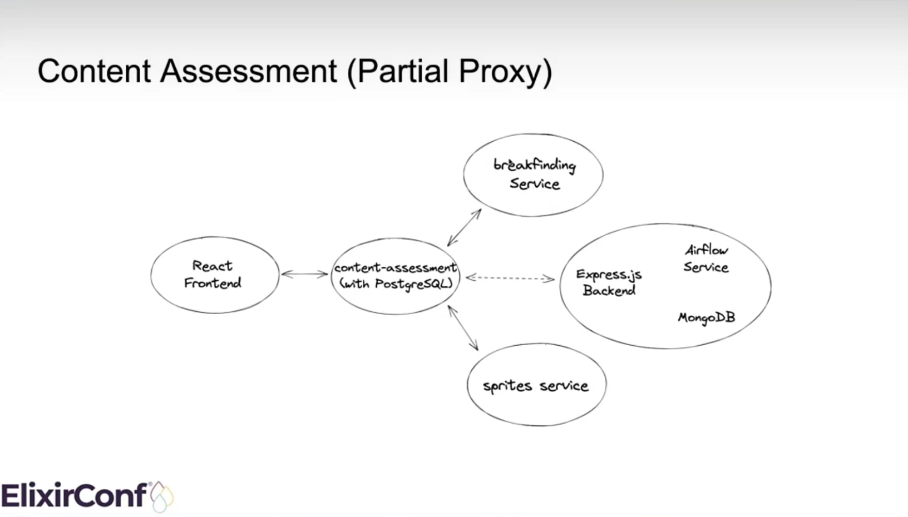
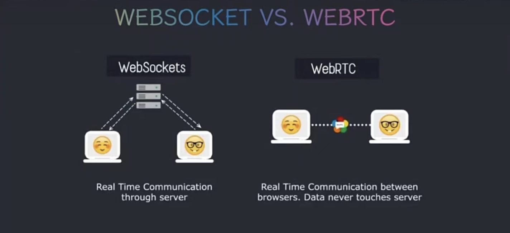
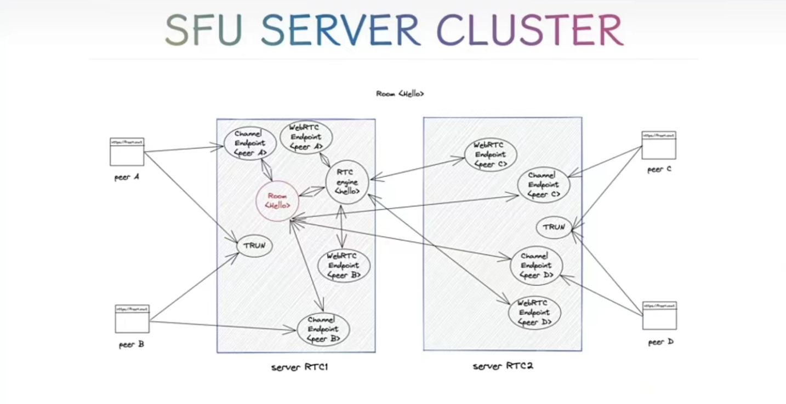
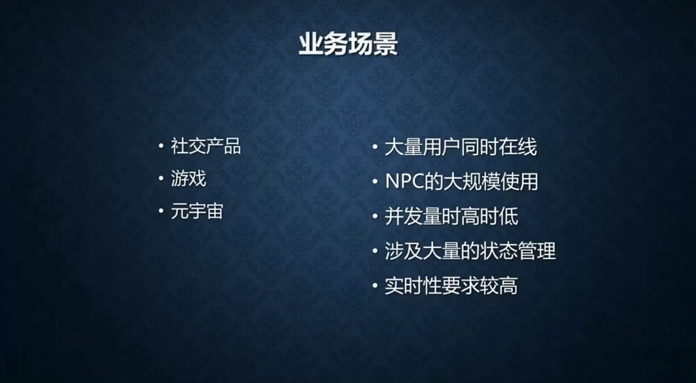
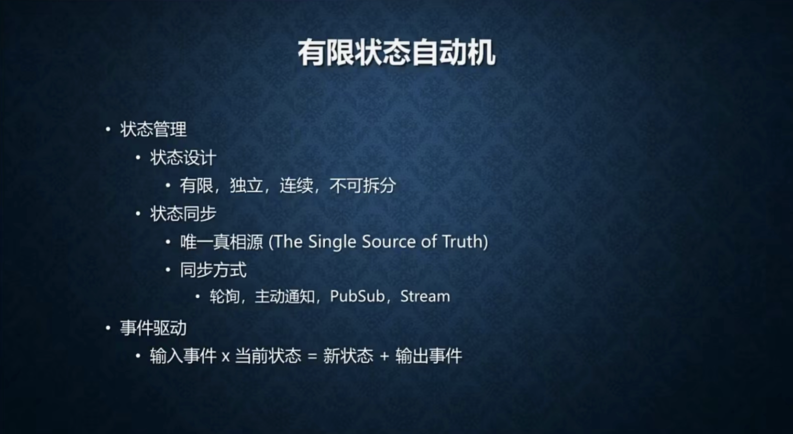
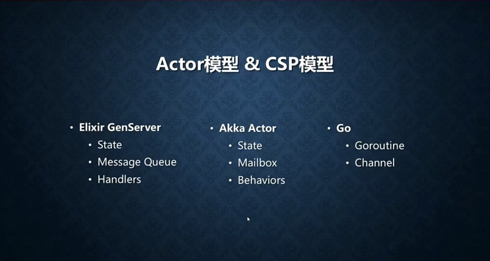
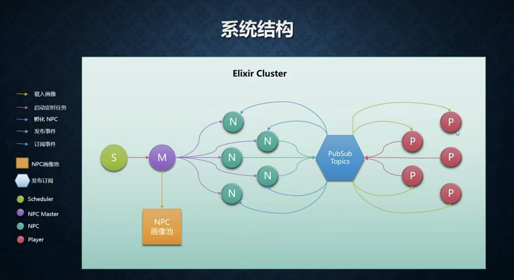

(应 Tubi 邀请，在 Tubi 的 Meetup 后写作此技术感想，同步到个人博客，仅做记录)

接触 Elixir 细算下来也有三四年了，但一直没有机会在正式的项目中投入使用，也并不清楚像 tubi 这样的公司是用怎样的姿势打开 Elixir 的盒子的，所以及早地报名参加了这次 meetup，收获了很多以前不曾深入了解的知识，重新审视了 Elixir 的亮点，相信以后在使用 Elixir 的时候会更能把握其精髓之处。

### Tubi 如何将无人维护的旧系统平稳无感地迁移到 Elixir 上

首先是一鸣大佬带来的“Tubi 旧系统迁移”，一鸣先讲述了 Content Assessment 这个旧系统（Express.js + MongoDB 实现）的基本结构，想逐步将旧系统迁移到用 Elixir + PostgreSQL 实现的新系统上。

*Content Assessment 服务结构*

为了实现新系统的平滑迁移，于是用 Elixir 构建了一层代理进行请求转发，然后逐步替换 API 的实现，为了确保新的实现和旧有系统的是一致的，还专门设计了一套 diff response 过程，diff 会确保新旧请求的一致性。

分享过后，有同学问到关于 Elixir 的性能问题，我觉得一鸣答得非常中肯：语言之间的差异往往很小，代码质量本身往往影响会更大。
另外一鸣谈到为什么选择 Elixir 的时候，解释了团队构成，因为团队事先就有 Elixir/Scala 经验，所以选择 Elixir 相对顺滑。大伟老师谈到这个问题的时候，肯定了 Elixir 的表达能力，放弃 Java 这种表达能力不强，需要大团队才能维护起来的架构，而选择 Elixir 往往一个人就可以挑大梁。而缺点的话，Elixir 肯定没有 Java 包多，有很多轮子需要自己造，不管是用 native 方式用 C/C++ 实现也好，还是用 Elixir 重新造一个，都是不可避免要亲手去造轮子的。

### 用 Elixir 开发 WebRTC 应用

马大伟老师是 `free4chat` 的作者，这个项目在 GitHub 上已经有 800+ star，对于一个 Elixir 项目来讲已经有着很不错的影响力了。大伟老师分享了如何使用 Elixir 进行一个 WebRTC 音频聊天的功能：

*WebSocket 与 WebRTC 区别*

WebRTC 因为不需要消耗服务器的大量链接资源，而可以在客户端直接进行点对点通信，目前已经在 Chromium 的 v8 引擎中实现，所以应用场景将来可以说是潜力无限。

大伟老师特地讲了其中 SFU Server（实现了 WebRTC 协议的服务）的集群实现，这里充分利用了 erlang 自有的集群能力，把两台服务器集群，这样不同的用户（图中 peer1 - peer4）便可以进行连接链路的建立。

*SFU Server 集群*

在 Elixir 的 GenServer 支持下，这个 SFU Server 集群的创建变得异常简单，如果用其他的语言（比如 Java），则实现起来会很复杂，没办法专注于业务代码的表达，为了能让集群正确地通信便已耗费了巨大的成本，这也是大伟老师毅然选择 Elixir 的很重要的一个原因。

### 分布式虚拟玩家 Distributed Online NPC

最后是由田宇老师带来的“分布式虚拟玩家”，同样利用了 Elixir 便捷且强大的集群能力，十分轻松地便创造了一个分布式的可大量用户同时在线的服务。

*业务场景*

因为玩家、NPC之间可以进行关注、取关等操作，或者当一个玩家关注的偶像进入了某房间（可视作为于一个事件源）则玩家也会同步进入该房间，所以会有大量的状态管理，而且还会对实时性有较高的要求，这里的并发就会极高。于是田宇老师就此切入分享了 Elixir 下的有限状态自动机的实现，解释了为什么 Elixir 可以支持如此高的并发。

*有限状态机*

Actor 模型和 CSP（Communication Sequential Process, 通信顺序进程） 模型是目前最主流的两个利用通信共享数据的模型，虽然 Elixir GenServer 并未承认自己是 Actor 模型，但通过对比发现其实与 Akka Actor 几乎毫无差异 —— 都是使用消息进行线程通信，所以我们可以对两者不加区分地进行理解。

*Actor & CSP 对比*

Go 的 Channel 是全部进程都使用同一个队列，交给系统进行调度，而 Actor 则会自行维护一个消息队列，然后依次处理，其 Handlers / Behaviors 天生就是一个有限状态机，所以采用 Actor 模型进行状态管理是一个非常自然且合理的选择。

通过 Phoenix 的 PubSub 进行事件的发布和订阅，便轻松地将大量的状态在各个不同的进程中实现了同步。开发者也不再耗费心力去实现网络带来的问题，从而能更专注地去实现业务逻辑。

*系统结构*

最后田宇老师还为这次 meetup 准备了一个 demo，然后给大家介绍了代码的实现细节，可谓十分用心。这种从抽象理论到具体实践的分享也让我收获颇深。

### 总结

Elixir 与其说是一个语言，更准确地说应该是一套技术方案，开发者可以很方便地拿着 GenServer 一把梭，很少会担心那些非业务问题带来的烦恼。

在提问环节，三位大佬分享了为什么选择 Elixir 以及如何学习 Elixir —— 当然是去看官方教程然后做做项目练手，大家果然都是这么过来的。至于为什么选择 Elixir，我相信这次 meetup 的内容已经很好地给出了一个答案。
